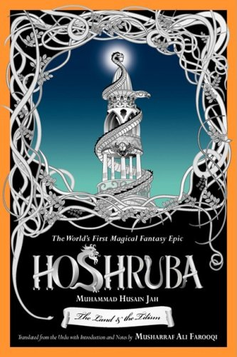

# hoshruba

Tor.com recently published the entire first book in the Hoshruba series as a [series
of blog posts](http://www.tor.com/features/series/hoshruba-series/). This script
downloads all of these posts and converts them into a publishable format, including
epub, mobi, pdf and html.

For obvious reasons, the converted ebook is not part of this repo. You must download
and run the script on your own machine to generate the copies.

## Requirements

- Ruby
- Nokogiri gem installed (`gem install nokogiri`)
- Unix system with `wget` installed
- `pandoc` installed and available
- `ebook-convert` (from calibre) available to generate the mobi file
- `wkhtmltopdf` for converting html to pdf
- `pdftk` to stitch the final PDF file
- `imagemagick` to convert jpg to PDF

The final 3 tools can be skipped if you don't care about the PDF generation.

You can also skip calibre if you only want the EPUB file.

# Setup

After downloading the repo and installing the requirements, just run

    ruby setup.rb

All the generated files will be saved with the filename `Hoshruba.{epub|pdf|mobi|html}`

# LICENSE

This is licensed under WTFPL. See COPYING file for the full text.

## Extra

A list of my other EBook generation projects: https://captnemo.in/ebooks/, includes a link to other related projects as well